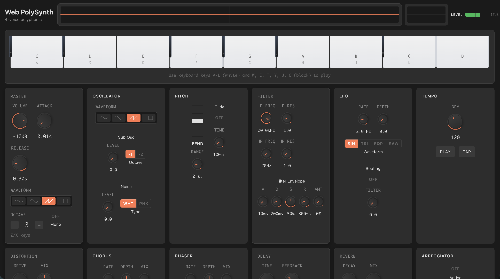

# Web PolySynth

A feature-rich, browser-based polyphonic synthesizer built with React, TypeScript, and Tone.js. Features an Ableton-inspired dark theme with real-time audio visualization.

**[Live Demo](https://atelic.github.io/web-polysynth)**



## Features

### Sound Engine
- **4-Voice Polyphony** - Play chords with up to 4 simultaneous notes
- **Mono Mode** - Last-note-priority legato for lead lines
- **4 Waveforms** - Sine, square, triangle, and sawtooth oscillators
- **Sub-Oscillator** - Adds low-end thickness, -1 or -2 octaves below
- **Noise Generator** - White or pink noise for texture and percussion

### Filters
- **Dual Filters** - Lowpass and highpass with resonance (Q) control
- **Filter Envelope** - Full ADSR envelope for dynamic filter sweeps
- **Envelope Amount** - Control how much the envelope affects cutoff

### Modulation
- **LFO** - Low-frequency oscillator with rate, depth, and 4 waveforms
- **Filter Cutoff Routing** - LFO modulation routed to filter for wobble effects
- **Glide/Portamento** - Smooth pitch transitions between notes
- **Pitch Bend** - Real-time pitch control with configurable range

### Effects
- **Distortion** - Add grit and harmonics with wet/dry control
- **Chorus** - Stereo widening with rate, depth, and mix
- **Phaser** - Classic phasing effect with adjustable parameters
- **Delay** - Tempo-synced delay with time, feedback, and mix
- **Reverb** - Algorithmic reverb with decay and wet controls

### Arpeggiator
- **4 Patterns** - Up, down, up-down, and random
- **Rate Control** - 1/4, 1/8, 1/16, or 1/32 notes
- **Octave Range** - Arpeggiate across 1, 2, or 3 octaves
- **Tempo Sync** - Locked to global BPM

### Tempo & Transport
- **Global BPM** - 40-240 BPM range
- **Tap Tempo** - Tap to set the tempo naturally
- **Transport Control** - Start/stop the sequencer clock

### Preset System
- **10 Factory Presets** - Bass, lead, pad, and FX starting points
- **User Presets** - Save and recall your own sounds
- **Local Storage** - Presets persist across sessions
- **Init & Reset** - Quickly return to default settings

### Visualizers
- **Waveform Display** - Real-time oscilloscope view
- **Spectrum Analyzer** - FFT frequency visualization
- **VU Meter** - Output level monitoring

### User Interface
- **Ableton-Inspired Design** - Professional dark theme
- **Responsive Layout** - Works on desktop and tablet
- **Rotary Knobs** - Smooth, mouse-draggable controls
- **Visual Keyboard** - Clickable piano keys with active states

## Keyboard Controls

### White Keys
| Key | Note |
|-----|------|
| A | C |
| S | D |
| D | E |
| F | F |
| G | G |
| H | A |
| J | B |
| K | C (octave up) |
| L | D (octave up) |

### Black Keys
| Key | Note |
|-----|------|
| W | C# |
| E | D# |
| T | F# |
| Y | G# |
| U | A# |
| O | C# (octave up) |

### Other Controls
- **Z / X** - Octave down / up

## Tech Stack

- **Framework**: React 18 with TypeScript
- **Audio**: Tone.js
- **Styling**: Tailwind CSS
- **Build**: Vite
- **Deployment**: GitHub Pages

## Development

### Prerequisites
- Node.js 25.2.1 (use `nvm use` if you have nvm configured)

### Setup
```bash
# Install dependencies
npm install

# Start development server
npm run dev

# Run linter
npm run lint

# Format code
npm run format

# Build for production
npm run build

# Deploy to GitHub Pages
npm run deploy
```

## Architecture

The synthesizer follows a modular architecture with React Context for state management:

```
App.tsx
└── SynthProvider (context)
    └── Synth.tsx
        ├── MasterModule
        ├── OscillatorModule
        ├── FilterModule
        ├── LFOModule
        ├── PitchModule
        ├── DistortionModule
        ├── ChorusModule
        ├── PhaserModule
        ├── DelayModule
        ├── ReverbModule
        ├── ArpeggiatorModule
        ├── TempoModule
        ├── PresetManager
        ├── Keyboard
        └── Visualizers (Waveform, Spectrum, VU)
```

### Signal Flow
```
PolySynth + SubOsc + Noise
        ↓
     Mixer
        ↓
   Lowpass Filter
        ↓
   Highpass Filter
        ↓
    Distortion
        ↓
      Chorus
        ↓
      Phaser
        ↓
      Delay
        ↓
      Reverb
        ↓
     Master
        ↓
   Meter/Analyzer
        ↓
   Audio Output
```

## Factory Presets

| Name | Category | Description |
|------|----------|-------------|
| Init | Lead | Clean starting point |
| Classic Bass | Bass | Punchy mono bass with sub |
| Acid Bass | Bass | TB-303 style squelchy bass |
| Screaming Lead | Lead | Distorted mono lead with chorus |
| Soft Pad | Pad | Warm, evolving pad sound |
| Warm Strings | Pad | Lush string-like pad |
| Pluck Lead | Lead | Sharp attack pluck sound |
| Wobble Bass | Bass | Dubstep-style LFO bass |
| Laser FX | FX | Sci-fi laser effects |
| Noise Sweep | FX | Filtered noise risers |

## License

MIT
